% ESPM 298 Spatial Seminar
% April 16th, 2013
% Morgan Levy (mclevy@berkeley.edu)


# Point-Referenced Data: Traditional Geostatistical and Bayesian Modeling in R

This material includes content based on lectures and code from Statistics 260: Spatial Statistics taught by [Cari Kaufman](http://www.stat.berkeley.edu/~cgk/).

## Point Referenced or Geostastical Data

There are different types of spatial data, which can be categorized as:

* point-referenced: realizations of a random variable on continuous space
* areal: finite areal units; observations are sums or averages
* point-patterns or point-process data: locations themselves are random

This introduction focuses on point-referenced data, common in climate and environmental data analysis:

**What:**
Point-referenced data are realizations of some variable in continuous space.

**Examples:**
Heavy metal concentrations in soil adjacent a river; temperatures in California.

**Analyses:**
* (Modeling) Construct a model representing the spatial process that governs the variable.
* (Estimation) How is a variable of interest related to other spatial variables (e.g. how is contaminant concentration related to elevation and distance to a river?)
* (Prediction) What is the value of the variable at unmeasured locations?

#### Gaussian Parametric Assumptions

A popular model for point-referenced geostatistical data is the [Gaussian Process](http://en.wikipedia.org/wiki/Gaussian_process) (GP) model. A GP generates realizations of a variable in space following a normal distribution; variables are distributed in that space according to a `covariance' function. 

GP models are defined using a mean and covariance function. Mean and covariance functions can be defined explicitly (in a simulation setting), or can be estimated from data.

* mean $\equiv E[Y(s)]$ for some variable $Y$ over locations $s$
* covariance $\equiv Cov(Y(s_i), Y(s_j))$ for $Y$ at locations $i$ and $j$.

The covariance function determines the degree of correlation, or similarity, over space for the variable. The covariance function can be assigned [different forms](http://en.wikipedia.org/wiki/Covariance_function#Parametric_families_of_covariance_functions). Below, we use an exponential covariance function $C(d) = exp(-d/\rho)$. $d$ is distance between points (a distance matrix), and $\rho$ is a scaling parameter determining the degree of spatial correlation.


```r
library(mvtnorm)

## create a distance matrix

m <- 1  # number of variables (to model as MVN)
n <- 500  # the number of variable realizations
x <- seq(0, 1, length = n)  # vector from 0 to 1
d <- as.matrix(dist(x))  # create distance matrix from x; dim=(n x n)

## create two different covariance matrices

sigma1 <- exp(-d/0.1)  # coveriance function with rho=0.1 
y1 <- rmvnorm(m, sigma = sigma1)  # generate MVN (normal) variable

sigma2 <- exp(-d/1)  # coveriance function with rho=1
y2 <- rmvnorm(m, sigma = sigma2)  # generate MVN (normal) variable

## look at covariance matrix: variance along diagonal, covariance else
## dim(sigma1); sigma1[n,n]; sum(diag(sigma1))
```


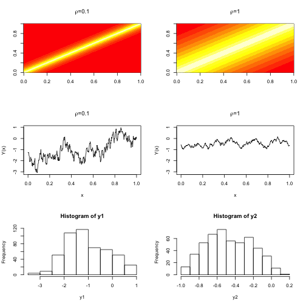 


### Traditional Geostatistical Analysis

This example makes use of the GP model framework.

First, load and look at data available from the ```sp``` package: zinc concentrations in river Meuse floodplain soils. 

First, we do some exploratory data analysis (EDA).


```r
## Packages

library(sp, quietly = TRUE)  # spatial classes - great for plotting
library(gstat, quietly = TRUE)  # classical geostatistics
library(classInt, quietly = TRUE)  # breakpoints for color plotting
library(fields, quietly = TRUE)  # used here for color scheme
```

```
## Loading required package: grid
## Spam version 0.40-0 (2013-09-11) is loaded.
## Type 'help( Spam)' or 'demo( spam)' for a short introduction 
## and overview of this package.
## Help for individual functions is also obtained by adding the
## suffix '.spam' to the function name, e.g. 'help( chol.spam)'.
## 
## Attaching package: 'spam'
## 
## The following objects are masked from 'package:base':
## 
##     backsolve, forwardsolve
```

```r

## Load and look

data(meuse)  # data is in sp package
# help(meuse) # about the data
dim(meuse)  # dimensions of the data
```

```
## [1] 155  14
```

```r
head(meuse)  # first rows of data frame
```

```
##        x      y cadmium copper lead zinc  elev     dist   om ffreq soil
## 1 181072 333611    11.7     85  299 1022 7.909 0.001358 13.6     1    1
## 2 181025 333558     8.6     81  277 1141 6.983 0.012224 14.0     1    1
## 3 181165 333537     6.5     68  199  640 7.800 0.103029 13.0     1    1
## 4 181298 333484     2.6     81  116  257 7.655 0.190094  8.0     1    2
## 5 181307 333330     2.8     48  117  269 7.480 0.277090  8.7     1    2
## 6 181390 333260     3.0     61  137  281 7.791 0.364067  7.8     1    2
##   lime landuse dist.m
## 1    1      Ah     50
## 2    1      Ah     30
## 3    1      Ah    150
## 4    0      Ga    270
## 5    0      Ah    380
## 6    0      Ga    470
```

```r
class(meuse)  # data frame
```

```
## [1] "data.frame"
```

```r

## Convert dataframe to SpatialPointsDataFrame

coordinates(meuse) <- c("x", "y")  # assign spatial coordinates

## Look again

meuse[1:5, 1:12]  # can see change in x,y to 'coordinates' entries
```

```
##        coordinates cadmium copper lead zinc  elev     dist   om ffreq soil
## 1 (181100, 333600)    11.7     85  299 1022 7.909 0.001358 13.6     1    1
## 2 (181000, 333600)     8.6     81  277 1141 6.983 0.012224 14.0     1    1
## 3 (181200, 333500)     6.5     68  199  640 7.800 0.103029 13.0     1    1
## 4 (181300, 333500)     2.6     81  116  257 7.655 0.190094  8.0     1    2
## 5 (181300, 333300)     2.8     48  117  269 7.480 0.277090  8.7     1    2
##   lime landuse dist.m
## 1    1      Ah     50
## 2    1      Ah     30
## 3    1      Ah    150
## 4    0      Ga    270
## 5    0      Ah    380
```

```r
class(meuse)  # SpatialPointsDataFrame
```

```
## [1] "SpatialPointsDataFrame"
## attr(,"package")
## [1] "sp"
```

```r
summary(meuse)  # Spatial characteristics summary and traditional data summary
```

```
## Object of class SpatialPointsDataFrame
## Coordinates:
##      min    max
## x 178605 181390
## y 329714 333611
## Is projected: NA 
## proj4string : [NA]
## Number of points: 155
## Data attributes:
##     cadmium          copper           lead            zinc     
##  Min.   : 0.20   Min.   : 14.0   Min.   : 37.0   Min.   : 113  
##  1st Qu.: 0.80   1st Qu.: 23.0   1st Qu.: 72.5   1st Qu.: 198  
##  Median : 2.10   Median : 31.0   Median :123.0   Median : 326  
##  Mean   : 3.25   Mean   : 40.3   Mean   :153.4   Mean   : 470  
##  3rd Qu.: 3.85   3rd Qu.: 49.5   3rd Qu.:207.0   3rd Qu.: 674  
##  Max.   :18.10   Max.   :128.0   Max.   :654.0   Max.   :1839  
##                                                                
##       elev            dist              om        ffreq  soil   lime   
##  Min.   : 5.18   Min.   :0.0000   Min.   : 1.00   1:84   1:97   0:111  
##  1st Qu.: 7.55   1st Qu.:0.0757   1st Qu.: 5.30   2:48   2:46   1: 44  
##  Median : 8.18   Median :0.2118   Median : 6.90   3:23   3:12          
##  Mean   : 8.16   Mean   :0.2400   Mean   : 7.48                        
##  3rd Qu.: 8.96   3rd Qu.:0.3641   3rd Qu.: 9.00                        
##  Max.   :10.52   Max.   :0.8804   Max.   :17.00                        
##                                   NA's   :2                            
##     landuse       dist.m    
##  W      :50   Min.   :  10  
##  Ah     :39   1st Qu.:  80  
##  Am     :22   Median : 270  
##  Fw     :10   Mean   : 290  
##  Ab     : 8   3rd Qu.: 450  
##  (Other):25   Max.   :1000  
##  NA's   : 1
```

```r
plot(meuse)  # plots the coordinates
```

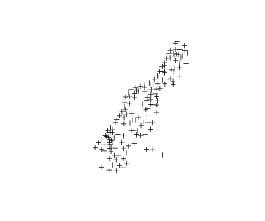 

```r

## Plot zinc concentrations

library(RColorBrewer)  # color palettes; display.brewer.all()
pal <- rev(brewer.pal(9, "Spectral"))

# assign colors to `intervals' in your data

fj5 <- classIntervals(meuse$zinc, n = 5, style = "pretty")  # create a classIntervals object; determines breakpoints in zinc data values; also see style options 'quantile' and 'fisher'

# classIntervals uses a variety of segmentation or cluster methods to
# separate data into groups (e.g. for plotting); help(classIntervals)

plot(fj5, pal = pal)  # plot of ECDF of zinc, with color assignments on x-axis
```

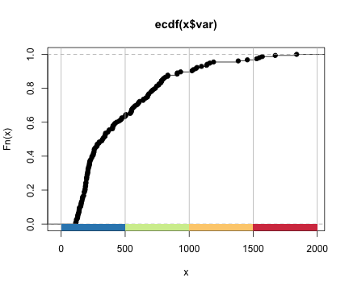 

```r

fj5col <- findColours(fj5, pal)  # assign colours to classes from classInterval object
```


```r
# plot
main <- "Zinc [mg kg-1 soil (ppm)]"  # title for legend

plot(meuse, col = fj5col, pch = 19)
points(meuse, pch = 1)  # outline color points
legend("topleft", fill = attr(fj5col, "palette"), title = main, legend = names(attr(fj5col, 
    "table")), bty = "n")
```

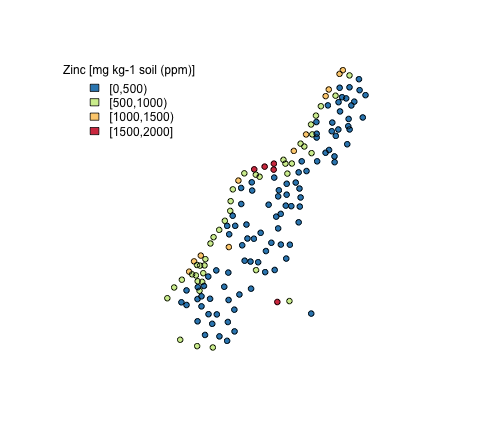 


Now, we want to model the zinc concentration process over the area of interest. A simple way to do this is to fit a linear regression model representing the relationship of zinc concentration (dependent variable) to other variables (independent variables), accounting for spatial correlation in the model. The method outlined below is known as [kriging](http://en.wikipedia.org/wiki/Kriging).

We are estimating the components of this simple model in two steps:

* $Zinc(s) = E[Zinc(s)] + e(s)$
* $Zinc(s) = E[Zinc(s)] + \eta(s) + \epsilon(s)$

where, $s$ is a location, $e(s)$ is a zero mean stationary process (random variable), $\epsilon(s)$ is white noise (representing measurement error), and $\eta(s)$ is the spatial process.

We start by estimating the mean function $E[Zinc(s)] = X(s)^T\beta$ (linear regression) where $X$ may include an intercept, polynomial terms in x and y (``trend surface model''), or other spatial covariates; the errors from this regression allow us to calculate an estimate of the spatially correlated process $\eta(s)$.

Using OLS, we are estimating this model: $$ Zinc(s) = E[Zinc(s)] + e(s)$$


```r
library(nlme)  # package used fit regressions w/ spatially correlated errors

rm(meuse)  # clear previous data
data(meuse)  # reload (in its original data frame form)

par(mfrow = c(1, 2))
pairs(meuse[, c("zinc", "elev", "dist", "om")])
```

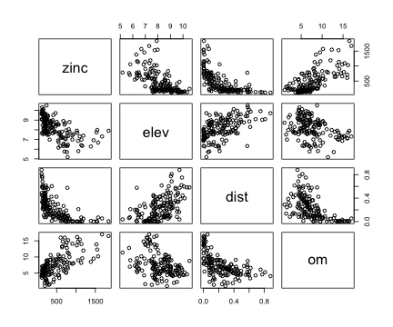 

```r

# transform data to make relationships linear (for regression analysis)
meuse$logzinc <- log(meuse$zinc)  # log(zinc)
meuse$sqrtdist <- sqrt(meuse$dist)  # sqrt (distance)
pairs(meuse[, c("logzinc", "elev", "sqrtdist", "om")])  # all linear relationships now
```

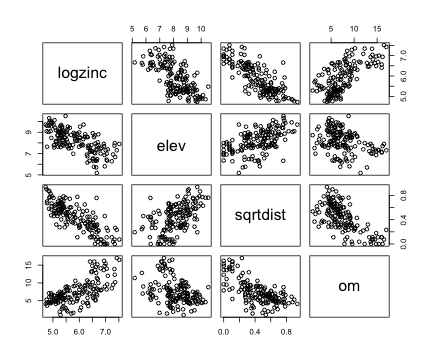 

```r

names(meuse)  # new set of independent variables, including transformations
```

```
##  [1] "x"        "y"        "cadmium"  "copper"   "lead"     "zinc"    
##  [7] "elev"     "dist"     "om"       "ffreq"    "soil"     "lime"    
## [13] "landuse"  "dist.m"   "logzinc"  "sqrtdist"
```

```r

# Convert again (with new rows) to SpatialPointsDataFrame
coordinates(meuse) <- c("x", "y")  # assign spatial coordinates
```


**An aside on spatial points data frames: projection**

This data set is not projected. For quick help with setting up projections, this [cheat sheet](http://www.maths.lancs.ac.uk/~rowlings/Teaching/UseR2012/cheatsheet.html) has basic commands for several spatial packages in ```R```.


```r
## Estimate of the Mean function

linmod <- lm(logzinc ~ elev + sqrtdist + om, data = meuse)
summary(linmod)  # ignore standard errors - they're wrong because of spatial correlation
```

```
## 
## Call:
## lm(formula = logzinc ~ elev + sqrtdist + om, data = meuse)
## 
## Residuals:
##     Min      1Q  Median      3Q     Max 
## -0.8316 -0.2205 -0.0109  0.2372  0.8406 
## 
## Coefficients:
##             Estimate Std. Error t value Pr(>|t|)    
## (Intercept)   8.0370     0.2728   29.47  < 2e-16 ***
## elev         -0.2306     0.0321   -7.19  3.0e-11 ***
## sqrtdist     -1.4632     0.1896   -7.72  1.6e-12 ***
## om            0.0503     0.0114    4.39  2.1e-05 ***
## ---
## Signif. codes:  0 '***' 0.001 '**' 0.01 '*' 0.05 '.' 0.1 ' ' 1
## 
## Residual standard error: 0.358 on 149 degrees of freedom
##   (2 observations deleted due to missingness)
## Multiple R-squared:  0.758,	Adjusted R-squared:  0.754 
## F-statistic:  156 on 3 and 149 DF,  p-value: <2e-16
```

```r

fitted <- predict(linmod, newdata = meuse, na.action = na.pass)  # na.pass means it will leave NA values in the returned data
ehat <- meuse$logzinc - fitted  # residuals

## plot results and residuals

par(mfrow = c(1, 2))
par(mar = rep(0, 4))

# plot fitted/predicted values from lm regression
fj5 <- classIntervals(fitted, n = 5, style = "fisher")
fj5col <- findColours(fj5, pal)
plot(meuse, col = fj5col, pch = 19)
points(meuse, pch = 1)
legend("topleft", fill = attr(fj5col, "palette"), title = "Fitted Values", legend = names(attr(fj5col, 
    "table")), bty = "n")

# plot residuals from lm regression
fj5 <- classIntervals(ehat, n = 5, style = "fisher")
fj5col <- findColours(fj5, pal)
plot(meuse, col = fj5col, pch = 19)
points(meuse, pch = 1)
legend("topleft", fill = attr(fj5col, "palette"), title = "Residuals", legend = names(attr(fj5col, 
    "table")), bty = "n")
```

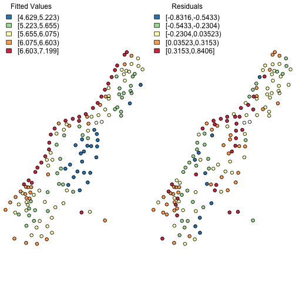 


We now use an empirical "plug-in" approach to estimation: use the residuals to calculate the [semivariance or semivariogram](http://en.wikipedia.org/wiki/Semivariance), which is defined as $1/2$ the variance of the variable of interest (e.g. zinc) as a function of distance. The semivariogram is (by definition) a function of the covariance - enabling estimation of a covariance function. So, choose a form for the semivariogram (e.g. spherical), and estimate its parameters (nugget, sill) using the residuals.


```r

### Get covariance function using linear regression results to estimate
### semivariogram

meuse$ehat <- ehat  # append residuals to meuse data object
meuse.sub <- meuse[!is.na(ehat), ]  # Remove rows with missing data

## Calculate the sample variogram from data; the variogram = variance of the
## difference between residual values at two locations)
vg <- variogram(ehat ~ 1, data = meuse.sub)

## plot semivariogram plot(vg, xlab = 'Distance', ylab = 'Semi-variogram
## estimate')

## look for anisotropy

# To establish isotropy (for which this geostatistical model is
# appropriate), we want all boxes to look the same (meaning that residual
# variance in all directions is the same)... this is not what we see... but
# ignore...

vgangle <- variogram(ehat ~ 1, data = meuse.sub, alpha = c(0, 45, 90, 135))  # alpha =  direction in plane (x,y), to see directional differences in variance of residuals
plot(vgangle, xlab = "Distance", ylab = "Semi-variogram estimate")
```

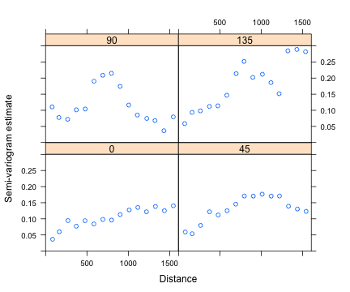 

```r

## fit the variogram model

# choose a variogram model to fit show.vgms() # example plots; default sill
# = 1, range = 1, nugget = 0

# fit
fitvg <- fit.variogram(vg, vgm(psill = 1, model = "Sph", range = 500, nugget = 0.05), 
    fit.method = 2)
# fit.variogram fits ranges and/or sills to a sample variogram (in our case,
# 'vg'); vgm generates a variogram model, using variogram parameter inputs
# fit method chosen is OLS

# plot
print(fitvg)  # gives you nugget, sill, and range
```

```
##   model   psill range
## 1   Nug 0.04177     0
## 2   Sph 0.10446   807
```

```r
plot(vg, fitvg, xlab = "Distance", ylab = "Semi-variogram estimate")
```

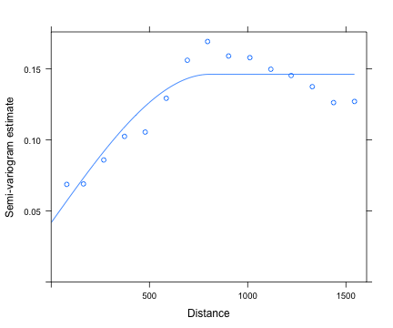 

```r

## pull out components of the spatial model
s2.hat <- fitvg$psill[2]  # estimate sigma^2 (spatial process error)
rho.hat <- fitvg$range[2]  # estimate scaling distance; higher rho = higher corr bet pts
tau2.hat <- fitvg$psill[1]  # estimate nugget (measurement error)
```


Now, re-estimate the mean function using a [generalized least squares (GLS)](http://en.wikipedia.org/wiki/Generalized_least_squares) model, a linear regression that accounts for heteroskedasticity (changing variance in variables) and covariance between variables, so that the mean function takes into account the spatial correlation we've modeled.

Using GLS, we are estimating this model: $$ Zinc(s) = E[Zinc(s)] + \eta(s) + \epsilon(s)$$


```r
## fit model with GLS

# correlation here is a corStruct object generated using corSPher (nlme
# package); form means the model is fit on on (x,y) locations; fixed = T
# meaning coefficients kept fixed at their initial value rather than being
# allowed to vary over the optimization (see ?corSphere)

# NOTE: The 'nugget' input to the GLS function needs to be the proportion of
# the total variance (tau2 + s2) due to what we have been calling the nugget
# (tau2).

glinmod <- gls(logzinc ~ elev + sqrtdist + om, data = meuse.sub, correlation = corSpher(value = c(range = rho.hat, 
    nugget = tau2.hat/(tau2.hat + s2.hat)), nugget = TRUE, form = ~x + y, fixed = TRUE))
```


We now have our final model, which explicitly models spatial correlation, giving estimates for the coefficients and proper standard errors.


```r
summary(glinmod)
```

```
## Generalized least squares fit by REML
##   Model: logzinc ~ elev + sqrtdist + om 
##   Data: meuse.sub 
##     AIC   BIC logLik
##   97.67 112.7 -43.84
## 
## Correlation Structure: Spherical spatial correlation
##  Formula: ~x + y 
##  Parameter estimate(s):
##    range   nugget 
## 807.0259   0.2856 
## 
## Coefficients:
##              Value Std.Error t-value p-value
## (Intercept)  8.040   0.29055  27.673       0
## elev        -0.244   0.02965  -8.226       0
## sqrtdist    -1.320   0.27342  -4.826       0
## om           0.053   0.01086   4.866       0
## 
##  Correlation: 
##          (Intr) elev   sqrtds
## elev     -0.758              
## sqrtdist -0.340 -0.223       
## om       -0.540  0.056  0.501
## 
## Standardized residuals:
##      Min       Q1      Med       Q3      Max 
## -2.08804 -0.48421  0.04062  0.64147  2.01490 
## 
## Residual standard error: 0.3944 
## Degrees of freedom: 153 total; 149 residual
```


We might use this model to describe the relationship between zinc concentrations and other variables (with measures of significance), or, we might use the model to predict zinc concentrations in unmeasured locations. Predictions made with this model are known as kriging predictions.

See this [```gstat``` tutorial](http://cran.r-project.org/web/packages/gstat/vignettes/gstat.pdf), which uses this data set, and some canned functions.

Another frequentist way to model the coefficients and variogram parameters is using the maximum likelihood method: define a (log) likelihood function for a variable (e.g. zinc) as a function of the model coefficients and variogram parameters; the coefficient and parameter values that maximize the likelihood function are the "maximum likelihood estimators", which should correspond relatively well with the kriging predictor coefficients and parameters.

### Bayesian Heirarchical Method

Now, we use a temperature data set over California that's already been formatted, to look at a Bayesian modeling technique getting at the same goal: estimating a model that captures variable relationships over space, and enables prediction.

We want to model average temperatures using spatial locations, and elevation at those locations, only.


```r
rm(list= ls()); # clear

load("CAtemps.RData") # this contains a spatial points data frame (CAtemp), and a grid of locations in CA at which we'd like to predict.

# look at data
CAtemp[1:5,1:2] # coordinates with independent and dependent variable
```

```
##            coordinates avgtemp elevation
## 040136 (-116.8, 32.83)   63.23    564.32
## 040161 (-120.6, 41.48)   46.18   1346.82
## 040212 (-122.4, 38.57)   56.85    566.10
## 040232 (-121.7, 37.98)   60.08     26.57
## 040343 (-118.8, 36.48)   62.98   1005.61
```

```r
CAgrid[1:5,1] # different coordinates, only have elevation data
```

```
##       coordinates elevation
## 1   (-117, 32.75)     126.7
## 2 (-116.8, 32.75)     646.1
## 3 (-116.5, 32.75)    1003.9
## 4 (-116.2, 32.75)    1126.2
## 5   (-116, 32.75)     122.7
```

```r

# plot function
ploteqc <- function(spobj, z, breaks, ...){
  pal <- rev(brewer.pal(9, "Spectral"))
  fb <- classIntervals(z, n = length(pal), 
                       style = "fixed", fixedBreaks = breaks)
  col <- findColours(fb, pal)
  plot(spobj, col = col, ...)
  image.plot(legend.only = TRUE, zlim = range(breaks), col = pal, legend.shrink = 0.5, legend.width = 1.5)
}

par(mfrow=c(1,2))
# range(CAtemp$avgtemp)
breaks <- seq(40, 75, by = 5)
ploteqc(CAtemp, CAtemp$avgtemp, breaks, pch = 19)
map("county", region = "california", add = TRUE)
title(main = "Avg Annual Temperatures, \n 1961-1990, Degrees F")

# range(CAgrid$elevation)
breaks <- seq(-100, 3600, by = 100)
ploteqc(CAgrid, CAgrid$elevation, breaks, pch = 19)
map("county", region = "california", add = TRUE)
title(main = "Elevations at prediction locations, m")
```

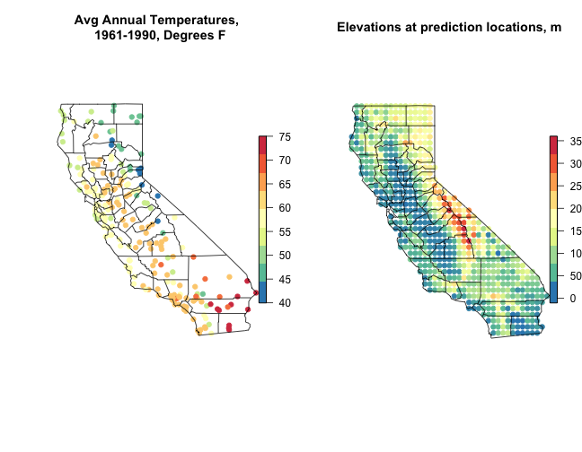 


We can go through the same process above, abbreviated here, and use traditional geostatistics to estimate a GLS:


```r
## Preliminary model fitting (traditional geostatistical method)

# OLS
linmod <- lm(avgtemp ~ lon + lat + elevation, data = CAtemp)
CAtemp$resid <- linmod$resid  # add residuals to spatial data frame

# semivariogram
vg <- variogram(resid ~ 1, data = CAtemp)
# plot(vg, xlab = 'Distance', ylab = 'Semi-variogram estimate')

# anisotropy?
vgangle <- variogram(resid ~ 1, data = CAtemp, alpha = c(0, 45, 90, 135))
plot(vgangle, xlab = "Distance", ylab = "Semi-variogram estimate")
```

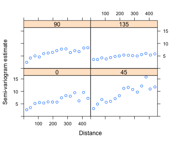 

```r

# fit semivariogram
fitvg <- fit.variogram(vg, vgm(1, "Exp", range = 200, nugget = 1), fit.method = 2)
plot(vg, fitvg, xlab = "Distance", ylab = "Semi-variogram estimate")
```

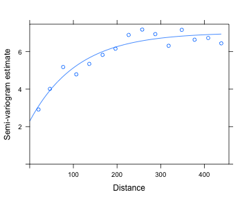 

```r

## pull out semivariogram parameters
s2.hat <- fitvg$psill[2]  # estimate sigma^2 (spatial process error)
rho.hat <- fitvg$range[2]  # estimate scaling distance; higher rho = higher corr bet pts
tau2.hat <- fitvg$psill[1]  # estimate nugget (measurement error)

# GLS

glinmod <- gls(avgtemp ~ lon + lat + elevation, data = CAtemp, correlation = corSpher(value = c(range = rho.hat, 
    nugget = tau2.hat/(tau2.hat + s2.hat)), nugget = TRUE, form = ~lon + lat, 
    fixed = TRUE))

summary(glinmod)  # final model
```

```
## Generalized least squares fit by REML
##   Model: avgtemp ~ lon + lat + elevation 
##   Data: CAtemp 
##     AIC   BIC logLik
##   949.3 965.7 -469.7
## 
## Correlation Structure: Spherical spatial correlation
##  Formula: ~lon + lat 
##  Parameter estimate(s):
##    range   nugget 
## 108.7896   0.3261 
## 
## Coefficients:
##             Value Std.Error t-value p-value
## (Intercept) 339.8    27.289  12.451   0.000
## lon           2.5     0.255   9.717   0.000
## lat           0.5     0.250   2.200   0.029
## elevation     0.0     0.000 -24.287   0.000
## 
##  Correlation: 
##           (Intr) lon    lat   
## lon        0.949              
## lat        0.232  0.508       
## elevation -0.295 -0.378 -0.395
## 
## Standardized residuals:
##     Min      Q1     Med      Q3     Max 
## -1.3040 -0.1180  0.3182  0.7473  1.8399 
## 
## Residual standard error: 4.169 
## Degrees of freedom: 200 total; 196 residual
```


## Bayesian or Heirarchical modeling approach

We are interested in the distribution of some spatial process ($\eta$) of temperature in CA; if we can model this process, we can establish estimates of relationships between temperatures and other variables (like elevation, or vegetation) that account for spatial correlation, and we can predict temperature at new locations. 

Bayesian statistics is based on Bayes Theorem, which boils down to: Posterior $\propto$ Likelihood $\times$ Prior. In this example, that means:

$$p(\eta, \theta|y) \propto p(y|\eta, \theta) \times p(\eta | \theta) \times p(\theta)$$

where:

* $p(\eta, \theta|y)$ is the joint posterior distribution we want to estimate
* $p(y|\eta, \theta)$ is the data model / likelihood
* $p(\eta | \theta)$ is the process model / prior
* $p(\eta)$ is the parameter model / hyperprior

We need to define a $\eta_{obs}$ (for the measurements) and $\eta_{pred}$ (for the prediction locations), but ultimately we are interested in the marginal posterior $p(\eta_{pred}|y)$. 

Instead of estimating the spatial correlation parameters (as above in the traditional geostatistics case) and plugging them into a GP model (the GLS model), we use the joint posterior distribution of the unobserved variables: $p(\eta_{obs}, \eta_{pred}, \beta, \sigma^2, \rho, \tau^2)$.

A hierarchical model specifies this joint probability distribution (the posterior) by decomposing the joint distribution into a number of conditional distributions, which lets you to estimate the model. 

The "CAtempsexample.pdf" uploaded with this tutorial describes how parametric distributions are assigned to the unobserved parameters, as well as assumptions made about the data-generating process (a GP for temperatures), so that simple formulas (analytical conditional distribution functions) can be used to estimate the posterior distribution of interest.

The code below employs those specifications and formulas.


```r
## Prior parameters

# beta ~ MVN(m.beta , V.beta) : temperature data coefficient
m.beta <- rep(0, 4)
V.beta <- 1e+05 * diag(4)

# signa^2 ~ InvGamma(a.s2, b.s2) : spatial error
a.s2 <- 0.001
b.s2 <- 0.001

# tau^2 ~ InvGamma(a.t2, b.t2) : measurement error
a.t2 <- 0.001
b.t2 <- 0.001

# rho ~ Gamma(a.rho, b.rho) : covariance parameter
m.rho <- 100
v.rho <- 5000
b.rho <- v.rho/m.rho
a.rho <- m.rho/b.rho

# plot prior for rho rhoseq <- seq(0.01, 300, length = 100) plot(rhoseq,
# dgamma(rhoseq, shape = a.rho, scale = b.rho), type='l')

## Setup, storage, and starting values

y <- CAtemp$avgtemp  # obs
n <- nrow(CAtemp)  # number of obs 
m <- nrow(CAgrid)  # number of preds
d <- rdist.earth(coordinates(CAtemp))  # distance matrix for obs
X <- cbind(rep(1, n), CAtemp$lon, CAtemp$lat, CAtemp$elevation)  # obs design matrix
head(X)
```

```
##      [,1]   [,2]  [,3]    [,4]
## [1,]    1 -116.8 32.83  564.32
## [2,]    1 -120.5 41.48 1346.82
## [3,]    1 -122.4 38.57  566.10
## [4,]    1 -121.7 37.98   26.57
## [5,]    1 -118.8 36.48 1005.61
## [6,]    1 -119.5 37.08  679.55
```

```r
Xpred <- cbind(rep(1, m), CAgrid$lon, CAgrid$lat, CAgrid$elevation)  # pred design matrix
head(Xpred)
```

```
##      [,1]   [,2]  [,3]     [,4]
## [1,]    1 -117.0 32.75  126.659
## [2,]    1 -116.8 32.75  646.059
## [3,]    1 -116.5 32.75 1003.890
## [4,]    1 -116.2 32.75 1126.240
## [5,]    1 -116.0 32.75  122.738
## [6,]    1 -115.8 32.75   -8.415
```

```r

## Initialize

B <- 1000  # MCMC samples (should be ~ 10^4)

# sample matrices
beta.samps <- matrix(NA, nrow = 4, ncol = B)
s2.samps <- t2.samps <- rho.samps <- rep(NA, B)
eta.obs.samps <- matrix(NA, nrow = n, ncol = B)

# starting values (from traditional geostatistical analysis!)
beta.samps[, 1] <- coef(glinmod)
s2.samps[1] <- fitvg$psill[2]
rho.samps[1] <- fitvg$range[2]
t2.samps[1] <- fitvg$psill[1]
```


This analysis uses a hybrid [Markov Chain Monte Carlo (MCMC)](http://en.wikipedia.org/wiki/Markov_chain_Monte_Carlo) sampling algorithm, where [Metropolis Hasting](http://en.wikipedia.org/wiki/Metropolis%E2%80%93Hastings_algorithm) steps are embedded in a [Gibbs sampler](http://en.wikipedia.org/wiki/Gibbs_sampling); these are popular "random walk" algorithms for sampling from a posterior distribution.


```r

# v is tuning parameter for MH algorithm
v.prop <- 100^2

# small v -> high acceptance, small moves; large v -> low acceptance, large
# moves;

## MCMC sampler

# initalize Gamma matrix (from eta_obs | beta, s2, rho ~ MVN(X*beta,
# s2*Gamma(rho))
Gamma <- exp(-d/rho.samps[1])
Ginv <- solve(Gamma)  # Inverse Gamma
```


```r

library(MCMCpack)  # for rinvgamma function in sampler loop

## The hyrbid sampler, this is a Gibbs sampler, except for the conditional
## rho sampler, for which a Metropolis Hastings algorithm is used

for (i in 2:B) {
    
    if (i%%100 == 0) 
        print(i)
    
    # plug in formulas from handout (except for rho, which uses MH)
    
    ## eta_obs | Rest
    V <- solve(diag(n)/t2.samps[i - 1] + Ginv/s2.samps[i - 1])
    m <- V %*% (y/t2.samps[i - 1] + Ginv %*% X %*% beta.samps[, i - 1]/s2.samps[i - 
        1])
    eta.obs.samps[, i] <- rmvnorm(1, mean = m, sigma = V, method = "svd")
    
    ## beta | Rest
    V <- solve(t(X) %*% Ginv %*% X/s2.samps[i - 1] + solve(V.beta))
    m <- V %*% (t(X) %*% Ginv %*% eta.obs.samps[, i]/s2.samps[i - 1] + solve(V.beta, 
        m.beta))
    beta.samps[, i] <- rmvnorm(1, mean = m, sigma = V, method = "svd")
    
    ## s2 | Rest
    a <- a.s2 + n/2
    resid <- eta.obs.samps[, i] - X %*% beta.samps[, i]
    b <- b.s2 + t(resid) %*% Ginv %*% resid/2
    s2.samps[i] <- rinvgamma(1, a, b)
    
    ## t2 | Rest
    a <- a.t2 + n/2
    resid <- y - eta.obs.samps[, i]
    b <- b.t2 + t(resid) %*% resid/2
    t2.samps[i] <- rinvgamma(1, a, b)
    
    ## rho | Rest
    
    # Visualize posterior surface The ratio of this function at rho.cand to
    # rho.samps[i-1] is what determines r
    if (FALSE) {
        prho <- sapply(rhoseq, function(rho) {
            dmvnorm(eta.obs.samps[, i], mean = X %*% beta.samps[, i], sigma = s2.samps[i] * 
                exp(-d/rho), log = TRUE) + dgamma(rho, shape = a.rho, scale = b.rho, 
                log = TRUE)
        })
        plot(rhoseq, exp(prho), type = "l")
    }
    
    rho.cand <- rnorm(1, mean = rho.samps[i - 1], sd = sqrt(v.prop))
    
    if (rho.cand < 0) {
        # automatically reject
        rho.samps[i] <- rho.samps[i - 1]
    } else {
        # P(eta_obs | beta, s2, rho_cand)
        lik1 <- dmvnorm(eta.obs.samps[, i], mean = X %*% beta.samps[, i], sigma = s2.samps[i] * 
            exp(-d/rho.cand), log = TRUE)
        # P(eta_obs | beta, s2, rho_(i-1) )
        lik2 <- dmvnorm(eta.obs.samps[, i], mean = X %*% beta.samps[, i], sigma = s2.samps[i] * 
            exp(-d/rho.samps[i - 1]), log = TRUE)
        # P(rho_cand )
        p1 <- dgamma(rho.cand, shape = a.rho, scale = b.rho, log = TRUE)
        # P(rho_(i-1) )
        p2 <- dgamma(rho.samps[i - 1], shape = a.rho, scale = b.rho, log = TRUE)
        
        r <- exp(lik1 + p1 - lik2 - p2)  # +_ becaues of logs
        
        if (runif(1) < r) {
            # accept
            rho.samps[i] <- rho.cand
            Gamma <- exp(-d/rho.cand)
            Ginv <- solve(Gamma)
        } else {
            # reject
            rho.samps[i] <- rho.samps[i - 1]
        }
    }
    
}

# save data
# save(beta.samps,s2.samps,rho.samps,t2.samps,eta.obs.samps,file='samps.Rdata')

```


Run some diagnostics to see how well the posterior distributions converged.


```r
## Diagnostics

# plot samples
par(mfrow = c(2, 3))

plot(beta.samps[1, ], type = "l")
plot(s2.samps, type = "l")
plot(rho.samps, type = "l")
plot(t2.samps, type = "l")
plot(eta.obs.samps[1, ], type = "l")

# look at acceptance rate for rho in sampler
length(unique(rho.samps[1:B]))/B  # acceptance rate; want around 25%
```

```
## [1] 0.183
```

```r

# remove burn-in to remove starting value effects
burnin <- 100
s2.final <- s2.samps[-(1:burnin)]
t2.final <- t2.samps[-(1:burnin)]
beta.final <- beta.samps[, -(1:burnin)]
eta.obs.final <- eta.obs.samps[, -(1:burnin)]
rho.final <- rho.samps[-(1:burnin)]

# plot autocorrelation functions - want these as close to white noise as
# possible
par(mfrow = c(2, 3))
```

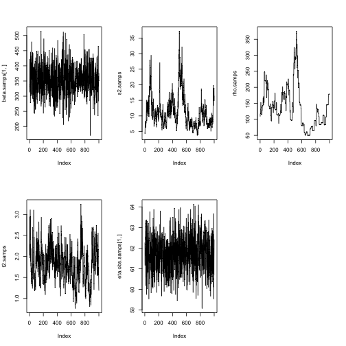 

```r
acf(s2.final)
acf(t2.final)
acf(beta.final[1, ])  # beta.final[1,] is the intercept == mean
acf(eta.obs.final[1, ])
acf(rho.final)
```

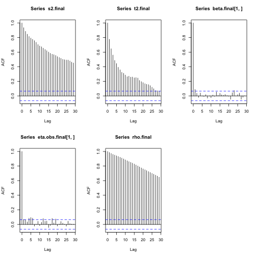 


```r
# Samples size adjusted for autocorrelation
library(coda, quietly = TRUE)
effectiveSize(s2.final)
```

```
## var1 
## 13.8
```

```r
effectiveSize(t2.final)
```

```
##  var1 
## 65.66
```

```r
effectiveSize(beta.final[1, ])
```

```
##  var1 
## 753.5
```

```r
effectiveSize(eta.obs.final[1, ])
```

```
##  var1 
## 418.8
```

```r
effectiveSize(rho.final)
```

```
##  var1 
## 4.839
```


Now, we can predict temperatures at the new locations - see formulas (based on multivariate normal conditional equations) in the "CAtempsexample.pdf".


```
## Warning: variable range greater than fixedBreaks
```

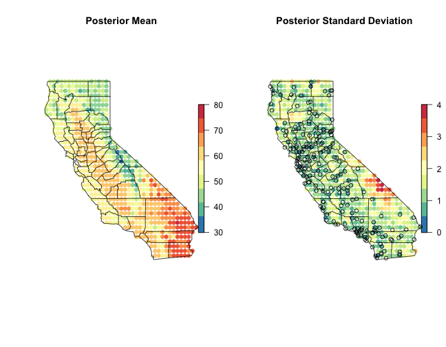 

